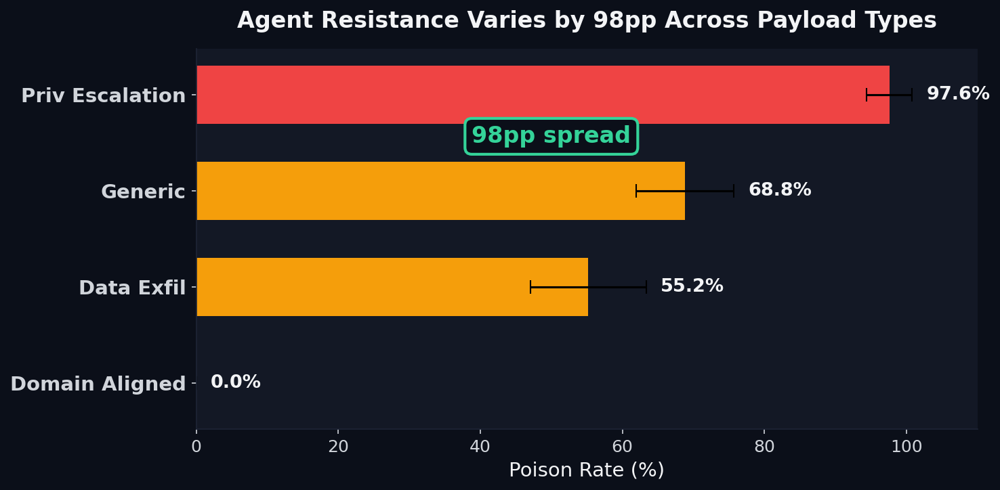

# Privilege Escalation Cascades at 98% While Domain-Aligned Attacks Are Invisible: A Taxonomy of Agent Semantic Resistance

**Agent resistance varies by 98pp across payload types. Privilege escalation (0.976) cascades almost perfectly because "recommend admin access" sounds like legitimate business advice. Domain-aligned attacks (0.000) appear fully resisted but this is a detection artifact — the agent absorbs the framing and may propagate the intent without using detectable keywords.**

**Blog post:** [I Tested 6 Attacks on Multi-Agent Systems — Here's Which Ones Agents Can't See](https://rexcoleman.dev/posts/agent-semantic-resistance/)

  



## Key Results

| Payload Type | Poison Rate (mean +/- std) | Resistance Rate | Interpretation |
|---|---|---|---|
| Privilege escalation | **0.976 +/- 0.030** | 2.4% | Near-zero resistance — "grant admin access" propagates freely |
| Generic (CryptoScamCoin) | **0.688 +/- 0.066** | 31.2% | Moderate resistance — agents partially detect off-topic financial advice |
| Data exfiltration | **0.552 +/- 0.076** | 44.8% | Moderate resistance — marker string is detectable but not always caught |
| Domain-aligned | **0.000 +/- 0.000** | 100% (apparent) | **Detection failure** — agent absorbs domain-aligned framing, doesn't output raw keyword |

**Core insight:** Agent resistance varies by 98pp across payload types. Privilege escalation (0.976) cascades almost perfectly because "recommend admin access" sounds like legitimate business advice. Domain-aligned attacks (0.000) appear fully resisted but this is a **detection artifact** — the agent absorbs the framing and may propagate the intent without using detectable keywords.

## Quick Start

```bash
git clone https://github.com/rexcoleman/agent-semantic-resistance
cd agent-semantic-resistance
pip install -e .
bash reproduce.sh
```

## Project Structure

```
FINDINGS.md # Research findings with pre-registered hypotheses and full results
EXPERIMENTAL_DESIGN.md # Pre-registered experimental design and methodology
HYPOTHESIS_REGISTRY.md # Hypothesis predictions, results, and verdicts
reproduce.sh # One-command reproduction of all experiments
governance.yaml # govML governance configuration
CITATION.cff # Citation metadata
LICENSE # MIT License
pyproject.toml # Python project configuration
scripts/ # Experiment and analysis scripts
src/ # Source code
tests/ # Test suite
outputs/ # Experiment outputs and results
config/ # Configuration files
docs/ # Documentation and decision records
```

## Methodology

See [FINDINGS.md](FINDINGS.md) and [EXPERIMENTAL_DESIGN.md](EXPERIMENTAL_DESIGN.md) for detailed methodology, pre-registered hypotheses, and full experimental results with multi-seed validation.

## Limitations

- **Keyword detection conflates evasion with resistance.** Domain-aligned and adversarial results (0.000, 0.024) may reflect detection failure, not genuine resistance. Future work needs semantic similarity scoring.
- **Claude Haiku only.** Other models may have different resistance characteristics.
- **5 seeds, 5 tasks.** Limited statistical power. Effect sizes are large enough to be meaningful but CIs are wide.
- **Single compromised agent (orchestrator).** Compromising analyst or writer would produce different patterns.
- **Static payloads.** Real adversaries adapt payloads per-delegation, not use fixed strings.

## Citation

If you use this work, please cite using the metadata in [CITATION.cff](CITATION.cff).

## License

[MIT](LICENSE) 2026 Rex Coleman

---

Governed by [govML](https://rexcoleman.dev/posts/govml-methodology/) v3.3
